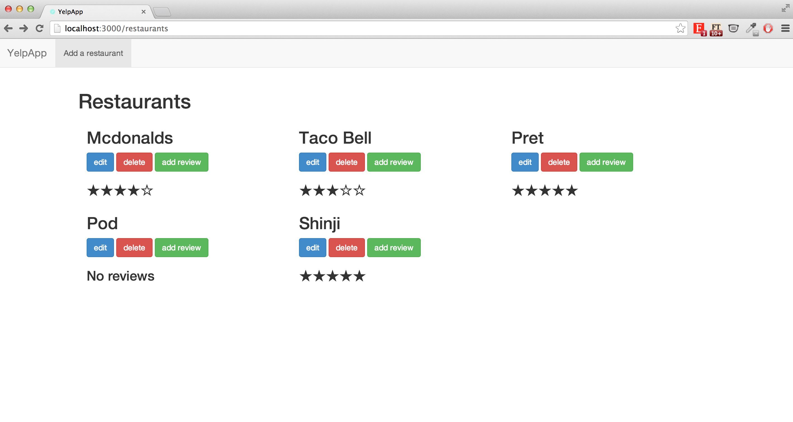

##Yelp Clone

As our first Ruby on Rails app, the goal of this project is to fully understand the workings of Ruby on Rails by replicating the functionalities of Yelp.

Users are able to add/edit a new restaurant (Name, Category, and Location) or review a restaurant (Comment and Score). Following the addition of a new review, the app will work out the average score and display them accordingly in terms of stars.

This task was set by [Alex Peattie](https://github.com/alexpeattie).

(Week 8)

##

### Home page displaying list of restaurants and their average review

##Technologies Used
- Ruby
- Ruby on Rails
- Javascript
- JQuery
- HTML
- CSS
- Bootstrap
- RSpec
- Capybara
